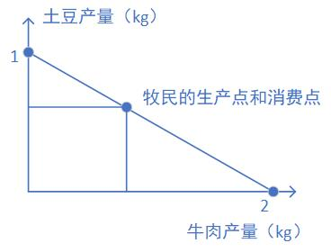
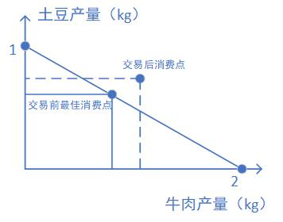

# 比较优势原理

发现曼昆的书上对比较优势原理 (Law of Comparative Advantage) 没有形式化的证明，尝试一下看能不能把这个问题说清楚。

## 二人世界

考虑一个简单的世界，只有俩人，一个牧民和一个农民。他们只生产两种产品，牛肉和土豆。牧民擅长牧牛产出羊肉，也会种点土豆但是产量不高。农民种土豆经验丰富，也会养牛但养的不好。

牧民的时间如果全用来养牛，平均下来每天能产出 2 kg 牛肉，如果全部用来种土豆，每天能产出 1 kg 土豆。农民的时间全部用来养牛，每天只能产出 1 kg 牛肉，但是时间用来种土豆的话每天有 4 kg 的产出。

一开始，俩人互不往来，自己生产的东西只有自己消费。牧民第一年大部分时间用来养牛，只生产很少的土豆，但是发现牛肉吃的有点腻了，第二年决定多花精力来种土豆。假设投入时间和产量成正比，那么牧民多投入一天时间种土豆，土豆产量会增加 1 kg，这一天用来种土豆就没法用来养牛了，所以牛肉产量减少了 2 kg，也就是说，1 kg 土豆的**机会成本（opportunity cost）**是 2 kg 牛肉。就这样，牧民每年都调整自己的时间分配，最终找到自己最满意的土豆和牛肉产量配比，让土豆和牛肉都不会吃的太腻或者吃的一样腻（此时土豆和牛肉的**边际收益**相等，称为**最佳消费点**），并且决定以后都按这个比例去分配时间。农民生产 1 kg 土豆的机会成本是 0.25kg 牛肉，农民同样也找到了自己的最佳消费点。

## 问题来了

在吃了几年最佳组合的土豆牛肉之后，牧民想出个好主意，去找农民。

> **牧民**：哥们，我想了一个注意！你多生产一点土豆，少生产一点牛肉，我负责多生产牛肉，减少土豆生产。
>
> 这样到年底咱们做个交易，保证交易完以后你得到的土豆和牛肉都比现在要多。
>
> **农民**：真的假的，如果这个交易对我这么有好处，就不可能同时对你也有好处啊。
>
> **牧民**：我算给你看。。

在牧民和农民生产能力不变的情况下，仅仅靠分工和交换就可以改善各自的境况么？

## 证明一下

上图斜线表示牧民的生产可能性边界，代表牧民选择牛肉产量时对土豆产量的影响。

为了方便后面分析，先定义变量，牛肉产量为 $N$ ，土豆产量为 $T$ ，生产土豆的机会成本为 $C_T$ ，生产牛肉的机会成本为 $C_N$ 。下标 $A$ 代表牧民， $B$ 代表农民， $p$ 代表生产点 (produce)， $c$ 代表消费点 (consume)， $e$ 代表交易量 (exchange)， $s$ 代表曲线上最佳消费点 (satisfy)。生产边界曲线上点的坐标为 $(N,T)$。如果没有发生交易，牧民最终满意的生产点和消费点必定重合。

牧民生产边界曲线的一般形式：

$$
aN+bT=M
$$

其中 $a,b$ 为系数，$M$ 为常数。该曲线斜率的绝对值即为生产1kg牛肉的机会成本：

$$
C_N = \frac{a}{b} \times\mbox{(1kg土豆)}
$$

同样，生产1kg土豆的机会成本为：

$$
C_T = \frac{b}{a} \times\mbox{(1kg牛肉)}
$$

|            | 牧民     | 农民 |
| :--------: | :------: | :--: |
| 牛肉生产点 | $N_{Ap}$ |    $N_{Bp}$  |
| 牛肉消费点 | $N_{Ac}$ |   $N_{Bc}$    |
| 土豆生产点 | $T_{Ap}$ |     $T_{Bp}$   |
| 土豆消费点 | $T_{Ac}$ |   $T_{Bc}$   |
| 土豆交易量 | $T_{Ae}$ |  $T_{Be}$    |
| 牛肉交易量 | $N_{Ae}$ |    $N_{Be}$  |

牧民或农民交易过后会发生三种情况：

1. 新的消费点依然落在生产边界曲线上（ $aN_{c}+bT_{c}=M​$ ）

2. 新的消费点落在生产边界曲线下侧（ $aN_{c}+bT_{c} \lt M​$ ）

3. 新的消费点落在生产边界曲线上侧（ $aN_{c}+bT_{c}>M​$ ）

   3.1 新的消费点在曲线上侧，且两个坐标都大于之前的最佳消费点（ $N_c>N_s$ , $T_c>T_s$ ）

   3.2 新的消费点在曲线上侧，且 $N_c>N_s​$ , $T_c \lt T_s​$

   3.3 新的消费点在曲线上侧，且 $N_c \lt N_s$ , $T_c>T_s​$

逐个分析：

- 情况1：对牧民来说，收益降低，此时的消费点虽然在生产边界曲线上，但已经偏离了最佳消费点。且曲线上消费点的移动完全可以靠移动生产点解决，没必要进行交易。
- 情况2：比情况1更糟糕，因为总能找到一个曲线上的消费点，坐标值均大于曲线内的消费点。
- 情况3：如果牧民和农民均能实现3.1，则交易对双方都有好处，如下图。

所以，单方同意交易的前提是交易之后两种产品的消费量均有增加。对牧民来说即：

$$
\begin{cases}
N_{Ap}+N_{e}>N_{As}&(3.a)\\
T_{Ap}-T_{e}>T_{As}&(3.b)
\end{cases}
$$

式 $(3.a)$ 乘 $a_A$ 与式 $(3.b)$ 乘 $b_A$ 求和，得：

$$
a_AN_{Ap}+b_AT_{Ap}+a_AN_{e}-b_AT_{e}>M_A
$$

将 $a_AN_{Ap}+b_AT_{Ap}=M_A$ 带入得：

$$
a_AN_{e}-b_AT_{e}>0
$$

假设交易时，土豆兑换牛肉的比率为 $k​$，即 $T_e=kN_e​$，则：

$$
\begin{align}
a_AN_{e}-b_A(kN_{e})>0\\
(a_A-b_Ak)N_{e}>0\\
\end{align}
$$

得到牧民愿意交易的充分条件：

$$
\mbox{A can exchange only if }
\begin{cases}
\mbox{}N_e>0,\ k<\frac{a_A}{b_A};\\
\mbox{}N_e<0,\ k>\frac{a_A}{b_A};
\end{cases} (8)
$$

农民同意交易的前提与牧民一致，有：

$$
a_B(N_{Bp}-N_{e})+b_B(T_{Bp}+T_{e})>M_B\\\Rightarrow
a_BN_{e}-b_BT_{e}<0\\
$$

可得农民愿意交易得充分条件：

$$
\mbox{B can exchange only if }
\begin{cases}
\mbox{} N_e>0,\ k>\frac{a_B}{b_B};\\
\mbox{} N_e<0,\ k<\frac{a_B}{b_B};
\end{cases} (10)
$$

式 $(8)​$ 和式 $(10)​$ 同时成立时：

$$
\mbox{A and B can make exchange when }
\begin{cases}
\mbox{} N_e>0,k\in[\frac{a_B}{b_B},\frac{a_A}{b_A}],\frac{a_A}{b_A}>\frac{a_B}{b_B};\\
\mbox{} N_e<0,k\in[\frac{a_A}{b_A},\frac{a_B}{b_B}],\frac{a_A}{b_A}<\frac{a_B}{b_B};\\
\end{cases} (11)
$$

由于 $N_e​$ 可任取，则牧民与农民完成交易的条件为：

$$
\frac{a_A}{b_A}\neq\frac{a_B}{b_B}
$$

根据上式，只要牧民和农民生产同一产品的机会成本不同，总能达成一种交易，使二者分工生产后再交易是有利可图的。

**证毕**。

## 结论分析

由于牧民生产1kg牛肉的机会成本（0.5kg土豆）比农民低（4kg土豆），有：

$$
\frac{a_A}{b_A}<\frac{a_B}{b_B}
$$

根据式 $(11)$，此时 $N_e<0$，代表牧民要想获利，需要用自己的牛肉交换农民的土豆。

这里引入**比较优势**（comparative advantage）的定义：生产某物品时机会成本较小的生产者，在生产该物品上具有比较优势。

**比较优势原理**是说，生产某种产品有比较优势的生产者，应该多生产这种产品，并将其用于交换其他产品。

## 结论推广

比较优势原理有两个推论很反直觉，值得玩味：

1. 在生产者生产能力没有增加的情况下，仅仅依靠分工合作，就可以增进交易双方的收益。
2. 在二人世界例子中，如果牧民时间全部用来种土豆每天能产出5kg土豆，也就是说牧民单位时间用来生产土豆或牛肉的产量都要高于农民，那么此时依然有必要进行交易。是比较优势，而不是绝对优势决定了交易是否有利可图。举个例子，哪怕你是一个落后国家，所有商品的生产力都不如某一个发达国家，但你仍然可以利用生产某一种商品的比较优势与发达国家交易，改善自己的处境。

## 参考

1. Mankiw, N. G. 经济学原理: 微观经济学分册. (北京大学出版社, 2012).
