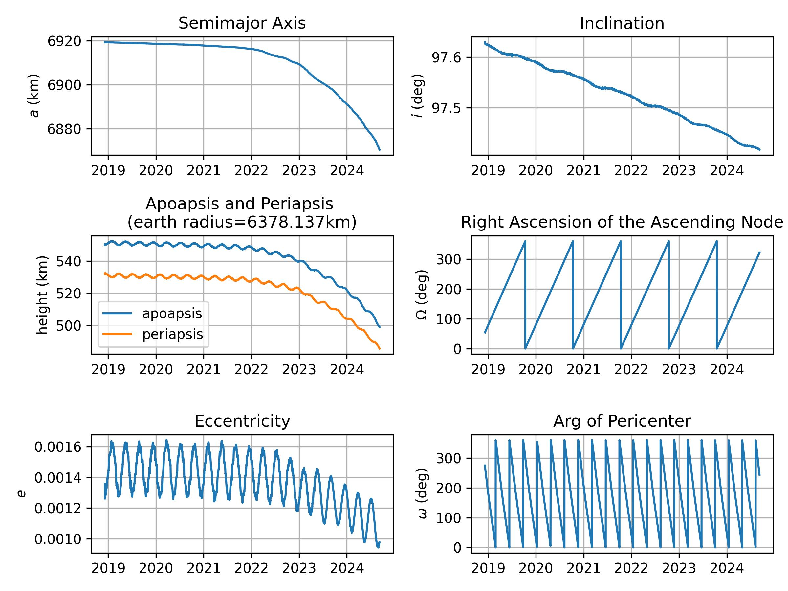

# 瓢虫一号轨道信息

2024-9-8 于 https://www.space-track.org 下载瓢虫一号接近 6 年的轨道信息

第一个 TLE 轨道信息如下

```
"CCSDS_OMM_VERS": "2.0",
"COMMENT": "GENERATED VIA SPACE-TRACK.ORG API",
"CREATION_DATE": "2018-12-07T17:34:16",
"ORIGINATOR": "18 SPCS",
"OBJECT_NAME": "TBA - TO BE ASSIGNED",
"OBJECT_ID": "2018-102D",
"CENTER_NAME": "EARTH",
"REF_FRAME": "TEME",
"TIME_SYSTEM": "UTC",
"MEAN_ELEMENT_THEORY": "SGP4",
"EPOCH": "2018-12-07T16:51:39.804192",
"MEAN_MOTION": "15.08341182",
"ECCENTRICITY": "0.00135640",
"INCLINATION": "97.6298",
"RA_OF_ASC_NODE": "54.1541",
"ARG_OF_PERICENTER": "271.3574",
"MEAN_ANOMALY": "192.3358",
"EPHEMERIS_TYPE": "0",
"CLASSIFICATION_TYPE": "U",
"NORAD_CAT_ID": "43834",
"ELEMENT_SET_NO": "999",
"REV_AT_EPOCH": "9",
"BSTAR": "0.00000000000000",
"MEAN_MOTION_DOT": "-0.00000064",
"MEAN_MOTION_DDOT": "0.0000000000000",
"SEMIMAJOR_AXIS": "6919.405",
"PERIOD": "95.469",
"APOAPSIS": "550.655",
"PERIAPSIS": "531.885",
"OBJECT_TYPE": "TBA",
"RCS_SIZE": null,
"COUNTRY_CODE": null,
"LAUNCH_DATE": null,
"SITE": null,
"DECAY_DATE": null,
"FILE": "2373316",
"GP_ID": "125100707",
"TLE_LINE0": "0 TBA - TO BE ASSIGNED",
"TLE_LINE1": "1 43834U 18102D   18341.70254403 -.00000064  00000-0  00000+0 0  9996",
"TLE_LINE2": "2 43834  97.6298  54.1541 0013564 271.3574 192.3358 15.08341182    96"
```

六年来轨道根数变化如图：

