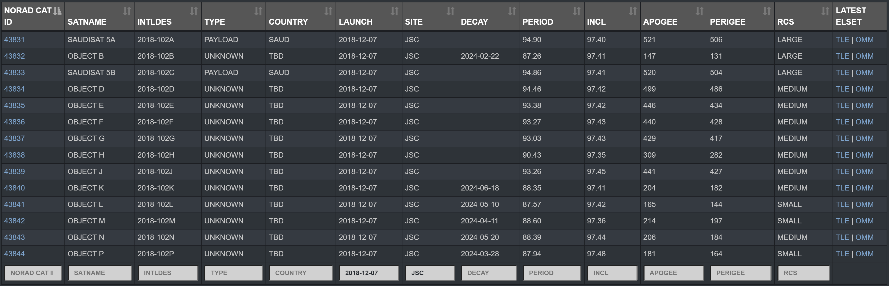

# 瓢虫一号轨道信息

2024-9-8 于 https://www.space-track.org 下载瓢虫一号接近 6 年的轨道信息

六年来轨道根数变化如图：


瓢虫一号 (NORAD_CAT_ID: 43834, OBJECT_NAME: OBJECT D) 于 2018 年 12 月 7 日发射. 发射信息如下图:



第一个 TLE 轨道信息如下

```
"CCSDS_OMM_VERS": "2.0",
"COMMENT": "GENERATED VIA SPACE-TRACK.ORG API",
"CREATION_DATE": "2018-12-07T17:34:16",
"ORIGINATOR": "18 SPCS",
"OBJECT_NAME": "TBA - TO BE ASSIGNED",
"OBJECT_ID": "2018-102D",
"CENTER_NAME": "EARTH",
"REF_FRAME": "TEME",
"TIME_SYSTEM": "UTC",
"MEAN_ELEMENT_THEORY": "SGP4",
"EPOCH": "2018-12-07T16:51:39.804192",
"MEAN_MOTION": "15.08341182",
"ECCENTRICITY": "0.00135640",
"INCLINATION": "97.6298",
"RA_OF_ASC_NODE": "54.1541",
"ARG_OF_PERICENTER": "271.3574",
"MEAN_ANOMALY": "192.3358",
"EPHEMERIS_TYPE": "0",
"CLASSIFICATION_TYPE": "U",
"NORAD_CAT_ID": "43834",
"ELEMENT_SET_NO": "999",
"REV_AT_EPOCH": "9",
"BSTAR": "0.00000000000000",
"MEAN_MOTION_DOT": "-0.00000064",
"MEAN_MOTION_DDOT": "0.0000000000000",
"SEMIMAJOR_AXIS": "6919.405",
"PERIOD": "95.469",
"APOAPSIS": "550.655",
"PERIAPSIS": "531.885",
"OBJECT_TYPE": "TBA",
"RCS_SIZE": null,
"COUNTRY_CODE": null,
"LAUNCH_DATE": null,
"SITE": null,
"DECAY_DATE": null,
"FILE": "2373316",
"GP_ID": "125100707",
"TLE_LINE0": "0 TBA - TO BE ASSIGNED",
"TLE_LINE1": "1 43834U 18102D   18341.70254403 -.00000064  00000-0  00000+0 0  9996",
"TLE_LINE2": "2 43834  97.6298  54.1541 0013564 271.3574 192.3358 15.08341182    96"
```

2024-9-8 最新 TLE 信息

```
"CCSDS_OMM_VERS": "2.0",
"COMMENT": "GENERATED VIA SPACE-TRACK.ORG API",
"CREATION_DATE": "2024-09-06T22:46:17",
"ORIGINATOR": "18 SPCS",
"OBJECT_NAME": "OBJECT D",
"OBJECT_ID": "2018-102D",
"CENTER_NAME": "EARTH",
"REF_FRAME": "TEME",
"TIME_SYSTEM": "UTC",
"MEAN_ELEMENT_THEORY": "SGP4",
"EPOCH": "2024-09-06T20:53:34.410624",
"MEAN_MOTION": "15.24500899",
"ECCENTRICITY": "0.00097790",
"INCLINATION": "97.4173",
"RA_OF_ASC_NODE": "321.4915",
"ARG_OF_PERICENTER": "243.6604",
"MEAN_ANOMALY": "116.3630",
"EPHEMERIS_TYPE": "0",
"CLASSIFICATION_TYPE": "U",
"NORAD_CAT_ID": "43834",
"ELEMENT_SET_NO": "999",
"REV_AT_EPOCH": "31732",
"BSTAR": "0.00118840000000",
"MEAN_MOTION_DOT": "0.00029270",
"MEAN_MOTION_DDOT": "0.0000000000000",
"SEMIMAJOR_AXIS": "6870.422",
"PERIOD": "94.457",
"APOAPSIS": "499.005",
"PERIAPSIS": "485.568",
"OBJECT_TYPE": "UNKNOWN",
"RCS_SIZE": "MEDIUM",
"COUNTRY_CODE": "TBD",
"LAUNCH_DATE": "2018-12-07",
"SITE": "JSC",
"DECAY_DATE": null,
"FILE": "4475210",
"GP_ID": "267333883",
"TLE_LINE0": "0 OBJECT D",
"TLE_LINE1": "1 43834U 18102D   24250.87053716  .00029270  00000-0  11884-2 0  9998",
"TLE_LINE2": "2 43834  97.4173 321.4915 0009779 243.6604 116.3630 15.24500899317326"
```

参数说明见此[链接](https://www.space-track.org/documentation#legend)